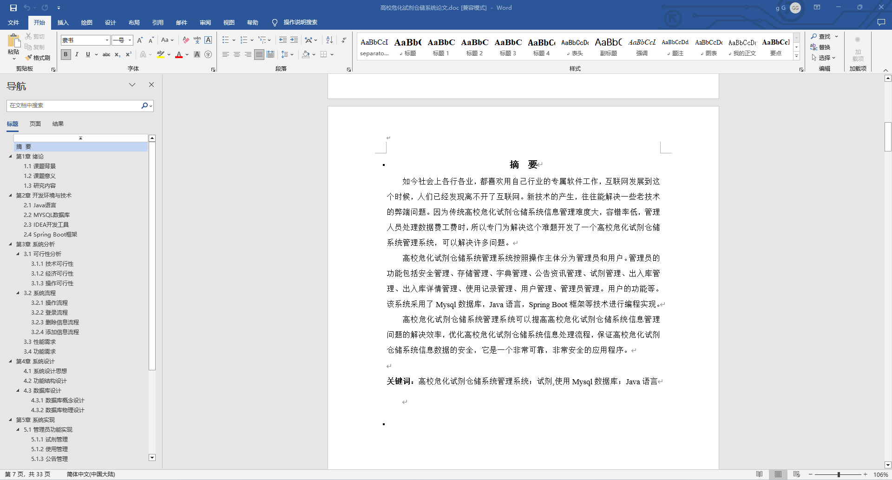
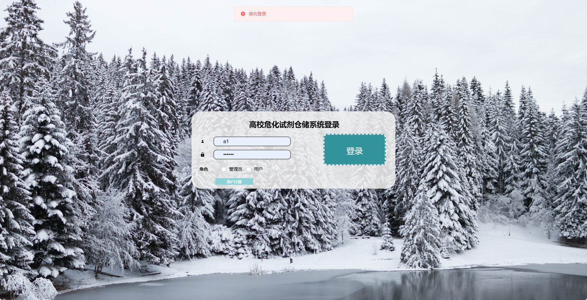
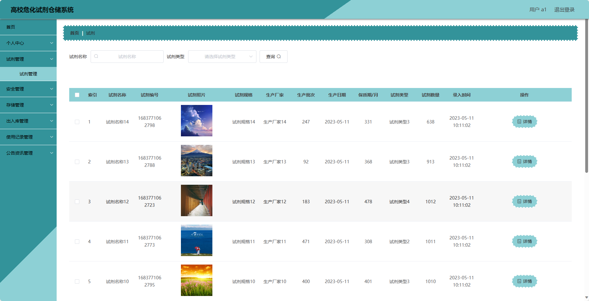
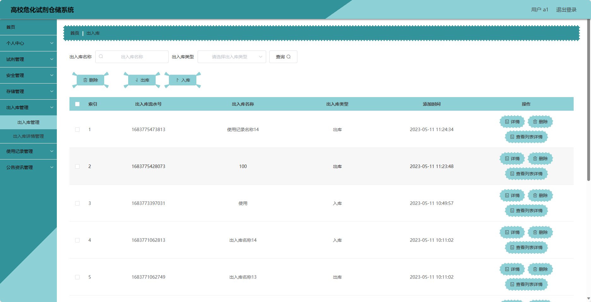
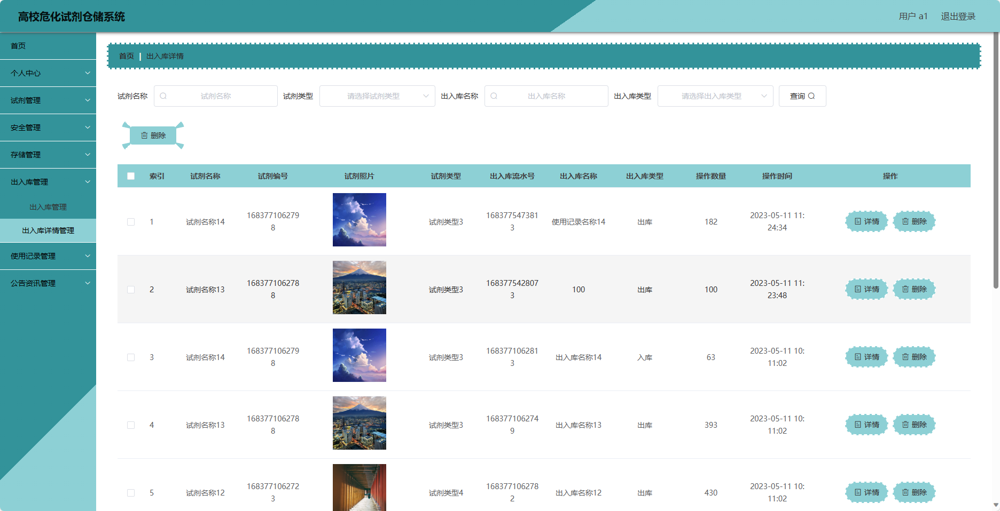
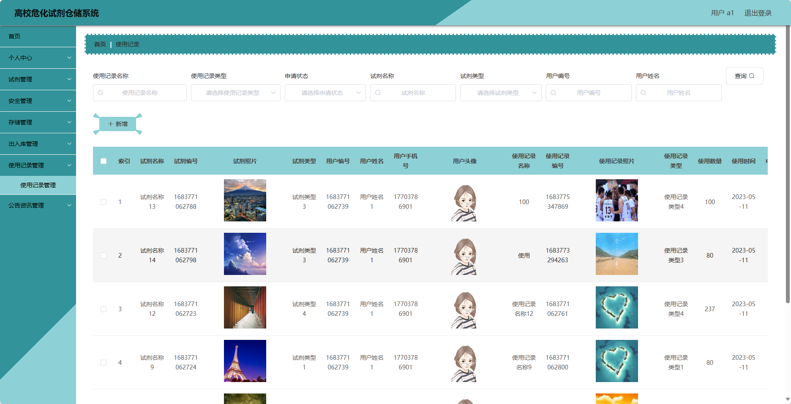
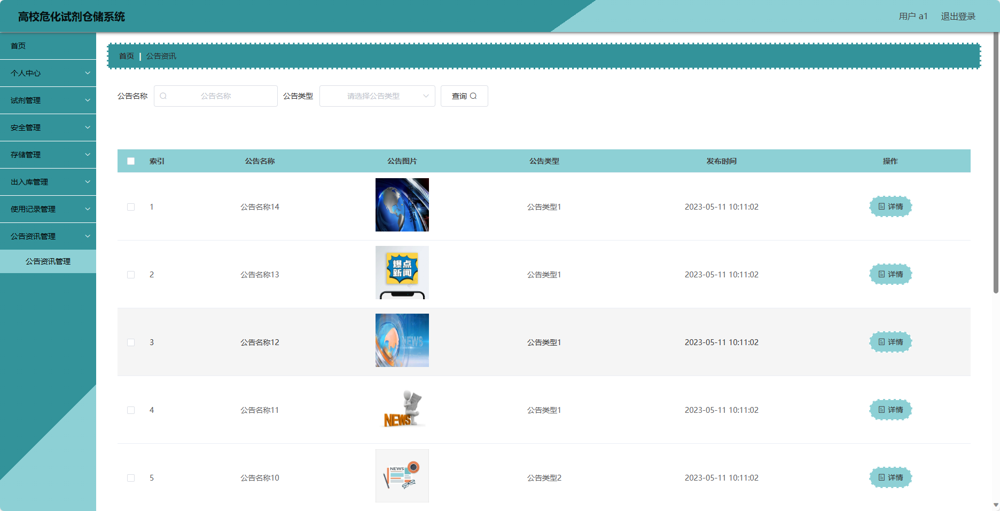
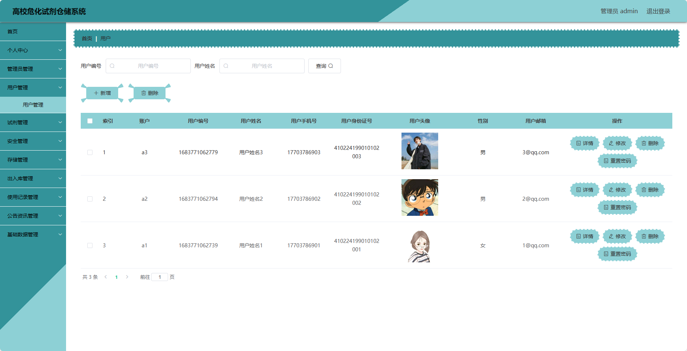
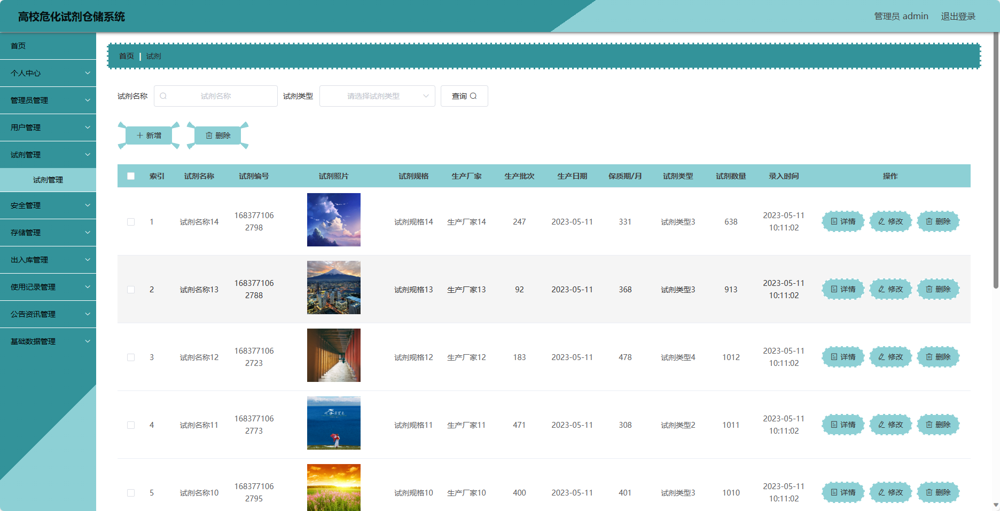
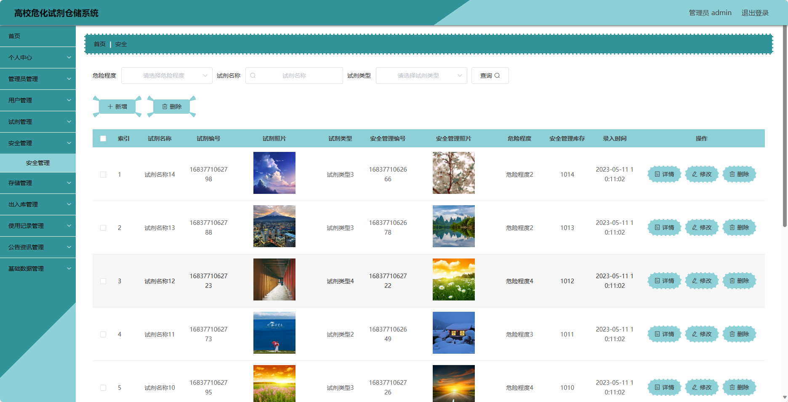

## 基于SpringBoot的高校危化试剂仓储系统(程序+报告)

###  获取sql数据库文件: 从戎源码网 (https://armycodes.com/) QQ: 386869957 QQ群: 377586148
###  所有系统地址: (https://github.com/YuLin-Coder/AllProjectCatalog) 
###  所有项目以及源代码本人均调试运行无问题 可支持远程安装部署调试、定制修改、代码讲解

## 项目介绍
基于SpringBoot的高校危化试剂仓储系统，系统包含两种角色：管理员、用户,系统分为前台和后台两大模块，主要功能如下。

### 【管理员】:
- 个人中心：管理个人信息。
- 管理员管理：管理系统管理员信息，包括添加管理员、编辑管理员、删除管理员等操作。
- 用户管理：管理系统用户信息，包括添加用户、编辑用户、删除用户等操作。
- 试剂管理：管理试剂信息，包括添加试剂、编辑试剂、删除试剂等操作。
- 安全管理：管理试剂的安全信息，包括设置试剂的安全措施、审核用户的安全申请等操作。
- 存储管理：管理试剂的存储位置，包括查看试剂的存储位置、调整试剂的存储位置等操作。
- 出入库管理：管理试剂的出入库记录，包括查看试剂的出入库记录、审核用户的借用归还申请等操作。
- 使用记录管理：管理试剂的使用记录，包括查看试剂的使用记录、记录试剂的使用情况等操作。
- 公告资讯管理：管理系统公告信息，包括发布和管理公告信息等操作。
- 基础数据管理：管理系统的基础数据，包括试剂分类、存储位置等数据的添加、编辑、删除等操作。

### 【用户】:
- 个人中心：管理个人信息。
- 试剂管理：查看试剂信息、搜索试剂、添加试剂、编辑试剂、删除试剂等操作。
- 安全管理：查看试剂的安全信息、设置试剂的安全措施等操作。
- 存储管理：查看试剂的存储位置、调整试剂的存储位置等操作。
- 出入库管理：查看试剂的出入库记录、进行试剂的借用归还等操作。
- 使用记录管理：查看试剂的使用记录、记录试剂的使用情况等操作。
- 公告资讯管理：查看系统公告、发布和管理公告信息等操作

## 项目技术
- 编程语言：Java
- 数据库：MySQL
- 项目管理工具：Maven
- 前端技术：HTML、CSS、JavaScript、Jquery、Vue
- 后端技术：Spring、SpringMVC、MyBatis

## 运行环境
- JDK版本：JDK1.8及以上
- 开发工具：IDEA、Ecplise、Myecplise都可以
- 数据库: MySQL5.7及以上
- Maven：maven3.0及以上
- Node：14.14.0及以上

## 运行截图

